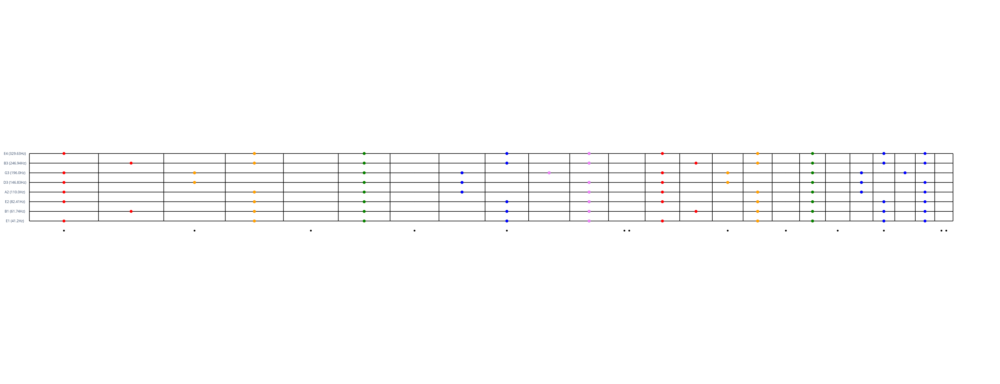

# Guitar Map

Guitar Map is a work-in-progress tool to procedurally generate and display fretboard diagrams for 4-10 string guitars and basses. This tool is intended to help guitarists familiarize themselves with the fretboard and basic music theory, especially to help understand how the relative positions between notes and chords changes when you use non-standard tunings or more than six strings. 

The tool allows you to configure:
* The number of strings
* Tuning for each string
* Tonic (root note) of the first mode of the scale: for example, if you input C as the tonic for the diatonic scale, it will create a C-Major scale if the Ionian (natural major) mode is selected. If you select the Aeolian (natural minor) mode, it will generate an A minor scale. 
* Scale (e.g. diatonic scale, harmonic minor, melodic minor, hungarian minor, etc. Hover over the scale name for a tool-tip with alternate names for each scale) 
* Mode of the scale (hover over the mode for a tool-tip with alternate names for each mode)

From those inputs it displays:
* A fretboard diagram with all positions on the fretboard labeled (hover over the fretboard position with your mouse to see the note name and frequency)
* All notes in the scale/mode are shown with circles. The tonic of the mode is shown in black (as described above, the tonic of the current mode selected may differ from the tonic of the first mode for the scale that is used to generate the scale)
* All chord voicings of the scale, click on the chord to display all the fretboard positions that are in the chord.

The below diagram shows a fretboard diagram for an 8-string guitar in drop-E tuning, using the diatonic scale, and Aeolian (natural minor) mode. Therefore the fretboard map is in E-minor. The E-minor chord is highlighted on the fretboard.


## Requirements
This program is built on the python `dash` and `dash-bootstrap-components` libraries. To run the program, install the dependencies natively on your system using your package manager, or set up a virtual environment. Once you have set up your environment, then run:

```
python plot_fretboard.py
```

and point your web browser to `http://127.0.0.1:8050/`
