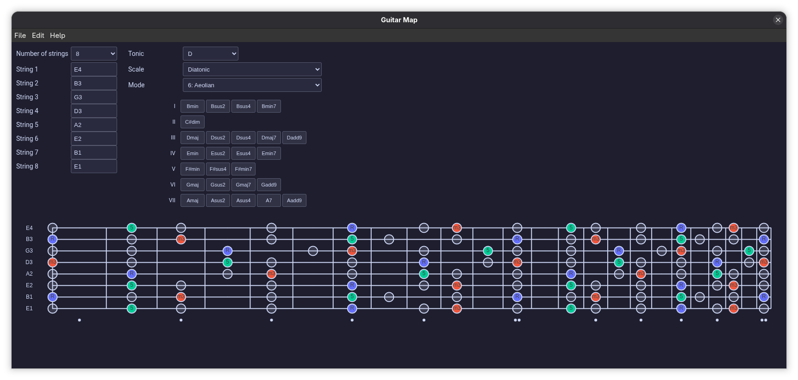

# Guitar Map

Guitar Map is a totally unique tool for learning the guitar fretboard as every diagram is procedurally generated, for any tuning — standard, drop, open, extended-range, or fully custom string-by-string configurations, for 4–10 string guitars and basses. Rather than drawing from a fixed library of hard-coded shapes the way most guitar fretboard apps do, Guitar Map computes scale positions, chord voicings, and note relationships from scratch for whatever tuning you select, covering most scales and modes in Western music. It is intended to help guitarists familiarize themselves with the fretboard, basic music theory, and understand the relationships between chords, particularly when using non-standard tunings or more than six strings.

What's more, Guitar Map is completely free. You can simply point your desktop or tablet browser to **[https://kwehage.github.io/guitar-map/](https://kwehage.github.io/guitar-map/)**. Or if you'd prefer a desktop experience, Guitar Map is also bundled as a standalone Electron application, which you can download from the releases page. Use the application completely without restriction for as long as you like. If you find it useful and want to contribute to the development of the app, you can buy me a coffee at the link below, or file bug reports or feature requests on this GitHub page (please check the [Known limitations](#known-limitations) section before submitting your feedback).

[](https://www.buymeacoffee.com/kwehage)



## Table of contents

* [Inputs](#inputs)
* [Outputs](#outputs)
* [Settings](#settings)
  * [Saving your settings](#saving-your-settings)
  * [Color Themes](#color-themes)
* [Using Guitar Map](#using-guitar-map)
  * [Option 1 — Web app (recommended)](#option-1-web-app-recommended)
  * [Option 2 — Electron desktop app](#option-2-electron-desktop-app)
* [MIDI](#midi)
  * [MIDI input — highlight notes and play audio](#midi-input-highlight-notes-and-play-audio)
  * [MIDI output — send chord voicings to a DAW](#midi-output-send-chord-voicings-to-a-daw)
  * [Setting up a virtual MIDI port](#setting-up-a-virtual-midi-port)
  * [Sharing a MIDI controller between Guitar Map and a DAW simultaneously](#sharing-a-midi-controller-between-guitar-map-and-a-daw-simultaneously)
* [Known limitations](#known-limitations)
* [License](#license)

## Inputs

The tool allows you to configure:
* **Tuning**: from the preferences dialog, choose from 27+ named presets spanning 4–8 string bass and guitar configurations — including standard, drop, open, and extended-range tunings (e.g. 7-string B Standard, 8-string Drop E, DADGAD, Mirar) — or select **Custom** to enter each string's pitch individually for a configurable number of strings up to 10.
* **Tonic** (root note) of the first mode of the scale — for example, inputting C as the tonic for the diatonic scale with the Ionian (natural major) mode selected produces a C-Major scale; selecting the Aeolian (natural minor) mode produces a relative A-minor scale.
* **Scale** (diatonic, harmonic minor, melodic minor, Hungarian minor, pentatonic, blues, augmented, diminished — hover over a mode name for a tooltip listing alternate names)
* **Mode** of the scale

## Outputs

From those inputs it displays:
* **A fretboard diagram**: with every position labeled — hover over any position to see the note name and frequency in Hz.
* **All notes in the scale highlighted** with circles; the tonic of the current mode is shown in black.
* **All diatonic chords for the scale**; click a chord to display every matching position on the fretboard.
* **Chord notes**: when a chord is selected, its notes are displayed as labeled / color-coded "chips". Clicking a tonic alteration chord (Neapolitan, ♭III, iv, ♭VI, ♭VII) shows its notes the same way.
* **Chord transition display**: when a transition or borrowed chord is also selected, a ↓ arrow appears and a second row of chips shows the notes of the target chord, making it easy to see voice-leading between two chords.
* **Common out-of-key chord transitions**: secondary dominant, chromatic mediants (major and minor third up and down).
* **Borrowed chord suggestions**: from parallel modes of the same scale.
* **Tonic alteration chords**: Neapolitan (♭II), ♭III, minor subdominant (iv), ♭VI, and subtonic (♭VII). If any of the altered chords are diatonic to the selected scale (e.g. they already show up in the list of diatonic chords, they will render as grayed out — they don't actually alter the key for the given scale/mode selected).
* A **Circle of Fifths** diagram that highlights the active key, shows the relative major/minor relationship, and displays the standard diatonic key signature — treble clef, sharps, and flats — for all twelve keys around the perimeter.
* **Click-to-identify chords**: when no chord is selected, click directly on the fretboard to pick out notes — one selection per string; clicking a different position on a string replaces the previous choice, and clicking the same position again clears it. Once three or more notes are selected, Guitar Map works out every chord that matches them, testing each note as a possible root so inversions are recognized too (shown in slash notation, e.g. `C/E`), and displays the result centered above the diagram. Picking a chord from the chord list clears the click selection.

## Settings

### Saving your settings
Settings (tuning preset, tonic, scale, mode, and color theme) are saved automatically in browser local storage and restored on next launch. Named settings files can be exported and re-imported via **File → Save / Open** (note this feature is only supported on the Electron desktop app).

### Color Themes
**Color Theme** (set in **⚙ Preferences → Color Theme**) changes the look of the fretboard, chord diagrams, Circle of Fifths, and surrounding interface. Three themes are available:
* **Light Jazz** — a clean, bright theme with crisp black-on-white contrast, luminous and expressive.
* **Blues** — a cool, low-contrast dark theme in deep indigo and periwinkle, evoking twilight skies over the Mississippi Delta — the birthplace of the blues.
* **Black Metal** — an evil, stark black-and-red theme with its own dissonance color palette dominated by embers, oxblood, and crimson — with a sickly acid green and a frostbitten ash-blue reserved for the harshest dissonances (the minor second and the tritone) so the "wrong" notes visually recoil.

## Using Guitar Map

### Option 1 — Web app (recommended)

Open Guitar Map directly in your browser — no installation required:

**[https://kwehage.github.io/guitar-map/](https://kwehage.github.io/guitar-map/)**

The app runs entirely in the browser. Settings are saved in local storage and persist between sessions.

#### Install as a standalone app (PWA)

Most browsers let you install Guitar Map as a standalone app that launches from your home screen or dock and works offline:

* **Chrome / Edge (desktop)**: click the install icon (⊕) in the address bar, or open the browser menu and choose **Install Guitar Map**.
* **Safari (iPhone / iPad)**: tap the Share button, then **Add to Home Screen**.
* **Chrome (Android)**: tap the browser menu and choose **Add to Home Screen**.

Once installed, the app opens in its own window without browser chrome and caches all assets for offline use.

---

### Option 2 — Electron desktop app

If you prefer a native desktop window without a browser, Guitar Map is also packaged as an Electron application.

#### Prebuilt binaries

Download the latest release for your platform from **[https://github.com/kwehage/guitar-map/releases](https://github.com/kwehage/guitar-map/releases)**.

##### Linux (AppImage)

```bash
# Download the AppImage (replace x.y.z with the version number)
wget https://github.com/kwehage/guitar-map/releases/download/vx.y.z/guitar-map-x.y.z.AppImage
chmod +x guitar-map-x.y.z.AppImage
./guitar-map-x.y.z.AppImage
```

No installation or root access is required. The AppImage is self-contained and runs on any modern x86-64 Linux distribution.

###### Desktop integration (optional)

To make Guitar Map appear in your application launcher, install the provided desktop entry. The install script places the launcher file and icon under `~/.local/share/` (no root required) and bakes the absolute path to the AppImage into the launcher. If you move the AppImage after installation, re-run the install script to update the path.

```bash
# Clone the repo (only needed for the install script and icon)
git clone https://github.com/kwehage/guitar-map
cd guitar-map

# Pass the path to the AppImage you downloaded
bash linux/install-desktop-entry.sh /path/to/guitar-map-x.y.z.AppImage
```

To uninstall the desktop entry:

```bash
rm ~/.local/share/applications/guitar-map.desktop
rm ~/.local/share/icons/hicolor/256x256/apps/guitar-map.png
update-desktop-database ~/.local/share/applications
```

##### macOS

* Download the `.dmg` from the releases page.
* Double-click the `.dmg` and drag the Guitar Map application to your Applications folder.

If macOS reports that the application is damaged and cannot be opened, this is Apple's Gatekeeper quarantine policy for applications distributed outside the App Store. Remove the quarantine attribute from the terminal:

```bash
xattr -rd com.apple.quarantine /Applications/guitar-map.app
xattr -rc /Applications/guitar-map.app
```

See [this guide](https://osxdaily.com/2019/02/13/fix-app-damaged-cant-be-opened-trash-error-mac/) for more detail.

##### Windows

* Download and run the `.exe` installer from the releases page.
* Launch Guitar Map from the Start menu or desktop shortcut.

#### Building from source

Requires [Node.js](https://nodejs.org/) (v18+) and, on Linux, `libfuse2`.

```bash
# Install Node.js v22 LTS via NodeSource (Linux)
curl -fsSL https://deb.nodesource.com/setup_22.x | sudo -E bash -
sudo apt-get install -y nodejs

# Install libfuse2 (required by the AppImage runtime on Linux)
sudo apt-get install libfuse2

git clone https://github.com/kwehage/guitar-map
cd guitar-map
npm install
npm run prebuild   # copies Plotly.js into dist/
npm run make       # produces the AppImage under out/make/
```

The AppImage will be written to `out/make/AppImage/x64/guitar-map-*.AppImage`.

To run without packaging:

```bash
npm run prebuild
npm start          # opens the app in an Electron window
```

## MIDI

### MIDI input — highlight notes and play audio

Connect a MIDI controller and select it in **⚙ Preferences → MIDI Input**. Notes played on the device are highlighted on the fretboard and played back through a synthetic plucked-string sound. Octave is respected — playing E2 highlights only E2 positions, not every E on the neck.

### MIDI output — send chord voicings to a DAW

Select a virtual MIDI port in **⚙ Preferences → MIDI Output**. With the **Send MIDI** checkbox enabled in the chord area, clicking any chord voicing diagram sends the chord notes to the selected port as MIDI note-on/off messages on channel 1, strummed low string to high at 28 ms per string.

### Setting up a virtual MIDI port

Browsers and Electron apps cannot create new system MIDI ports — they can only send to ports that already exist. To route MIDI between Guitar Map and a DAW you need a **virtual MIDI port**: a software loopback where Guitar Map writes to one end and the DAW reads from the other.

#### macOS — IAC Driver (built in, no extra software)

1. Open **Audio MIDI Setup** (`/Applications/Utilities/`)
2. **Window → Show MIDI Studio**
3. Double-click **IAC Driver**, check **Device is online**, click **+** to add a port if none exists, click **Apply**
4. In Guitar Map: **Preferences → MIDI Output** → select **IAC Driver Bus 1**
5. In your DAW: set a MIDI track input to **IAC Driver Bus 1**

#### Windows — loopMIDI (free)

1. Download and install [loopMIDI](https://www.tobias-erichsen.de/software/loopmidi.html)
2. Add a virtual port (click **+**), name it (e.g. *Guitar Map*)
3. In Guitar Map: **Preferences → MIDI Output** → select the loopMIDI port
4. In your DAW: set a MIDI track input to the same loopMIDI port

#### Linux — PipeWire + a2jmidid

PipeWire is the audio system on most modern Linux distributions. Install `pipewire-jack` to enable JACK compatibility, then use `a2jmidid` to bridge ALSA MIDI ports into PipeWire's graph:

```bash
# Arch
sudo pacman -S pipewire-jack

# Debian / Ubuntu
sudo apt install pipewire-jack
```

Start the bridge (keep this running while using Guitar Map):

```bash
pw-jack a2jmidid -e &
```

Open **Helvum** or **qpwgraph** (graphical PipeWire patchbay) and drag a cable from the **Midi Through** node to your DAW's MIDI input node. Then in Guitar Map: **Preferences → MIDI Output** → select **Midi Through Port-0**.

### Sharing a MIDI controller between Guitar Map and a DAW simultaneously

By default on Windows, a MIDI input port can only be opened by one application at a time. On macOS and Linux, multiple apps can read the same port at once. If your DAW has exclusive access to the port and Guitar Map cannot see the device:

- **macOS**: In the DAW, add an IAC Driver bus as a MIDI output and enable MIDI echo/through to that bus. Set Guitar Map's **MIDI Input** to the IAC bus.
- **Windows**: Install loopMIDI, configure the DAW to forward incoming MIDI to the loopMIDI port, set Guitar Map's **MIDI Input** to the loopMIDI port.
- **Linux (PipeWire)**: Run `pw-jack a2jmidid -e &`, then use Helvum or qpwgraph to fan the physical controller's ALSA port out to both the DAW and Guitar Map.

## Known limitations

* **Screen size**: Guitar Map displays a large amount of information simultaneously — fretboard diagram, chord buttons, tonic alterations, chord transitions, borrowed chords, and the Circle of Fifths — and is not designed for phone-sized screens. It is best viewed on a tablet in landscape mode or on a desktop computer with a widescreen display.
* **Performance**: the fretboard diagram is procedurally generated on every scale, mode, or tuning change — all note positions across every string and fret are computed from scratch each time. In addition, selecting a chord triggers the voicing finder, which searches for up to **Max chord voicings** results (set in **⚙ Preferences**, default 500 — lower it for faster results on slower devices) and applies heuristics to discard unplayable shapes before rendering the chord diagram grid. Both operations run entirely in the browser with no caching, so the app may feel slow or briefly unresponsive on a low-powered device such as a tablet. It is best used on a desktop computer with a large display.

* **Key signatures on the Circle of Fifths** are fixed to the standard diatonic (natural major / natural minor) key signatures for all twelve positions, regardless of the scale selected. For non-diatonic scales such as harmonic minor, melodic minor, or Hungarian minor, the raised or lowered scale degrees are not reflected in the displayed key signatures. Properly annotating these alterations (e.g. showing G♯ as an in-score accidental for A harmonic minor) is planned for a future release.
* **Chord voicing playability**: the chord-finding algorithm uses heuristics to discard obviously unplayable shapes (excessive hand span, large string skips), but the filtering is imperfect. Some displayed voicings may still be difficult or impossible to play, and occasionally playable shapes may be excluded. It is up to the player to judge which highlighted positions form practical chord shapes or arpeggios.
* **Audio and MIDI**: Guitar Map provides basic chord playback via Karplus-Strong synthesis and can send chord notes to an external instrument or DAW via MIDI output. While these features offer a useful way to audition chords, the app is primarily a learning tool for understanding the relationships between scales, modes, chords, and voicings on the fretboard — not a virtual instrument or performance tool.

## License

Guitar Map is licensed under the [Apache License 2.0](LICENSE).
